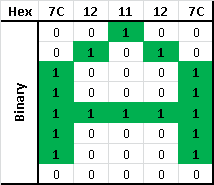
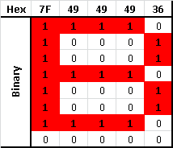
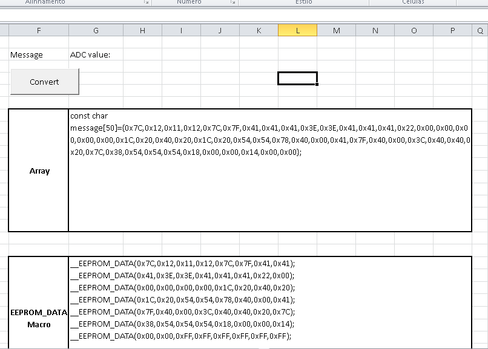
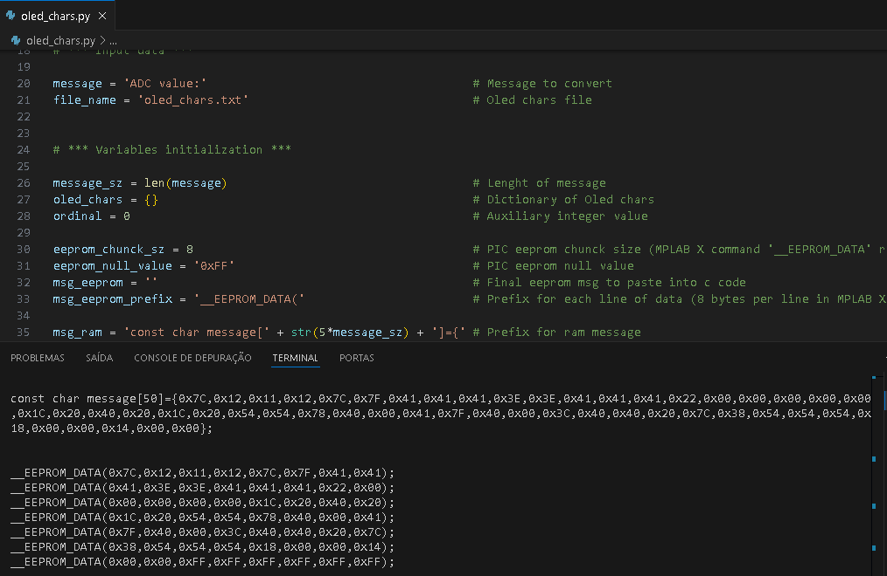
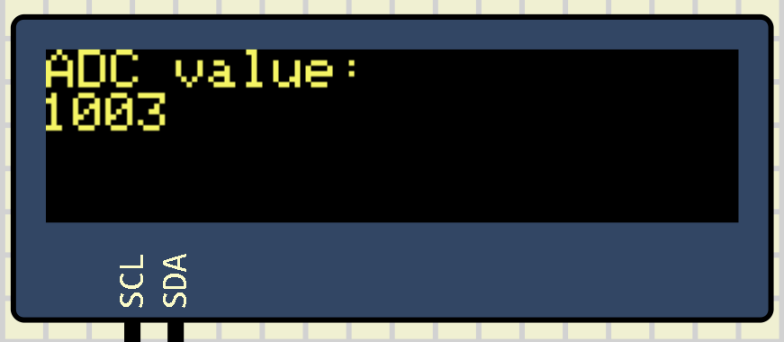
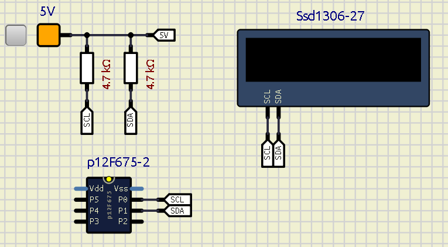
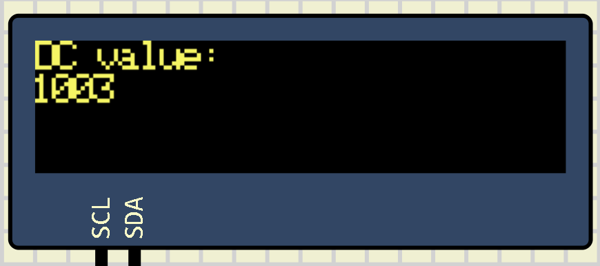
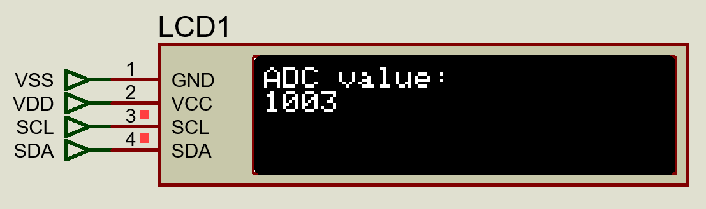
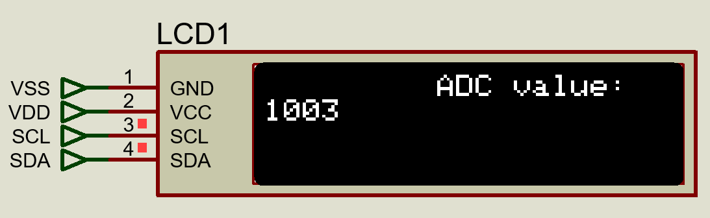

# OLED I2C Display for Low-End Microcontrollers

## Introduction

This project demonstrates that even resource-constrained microcontrollers (such as the PIC12F675) 
can utilize OLED displays without completely running out of program or data memory. 

In the development of this project, I used MPLAB X IDE (version 6.25) and XC8 Compiler (version 3.00)
for C code, SimulIDE (version 1.1.0-SR0) for simulation, and some additional tools (Excel and VS Code) to facilitate 
character mapping. I hope it will be useful!


## Basic premises:

I selected the PIC12F675 as the microcontroller, considering its limitations. 
This decision was easy as it's quite hard to buy electronic components at competitive 
prices in my country, and this specific PIC model is relatively cheap and readily available.

This MCU has the following characteristics:

- 8-bit architecture;
- 1.5 KB (1024 words) Flash Program Memory
- 64 bytes SRAM Data Memory
- 128 bytes EEPROM Data Memory
- 6 I/O Pins (5 general purpose I/O pins and 1 input-only pin)
- 4-channel 10-bit Analog-to-Digital Converter (ADC)
- 1 Analog Comparator
- 8-bit Timer (Timer0) with 8-bit Prescaler
- Internal 4 MHz Oscillator
- No I2C,UART or SPI native hardware

Given that MCU has few I/O pins, the most convenient approach is to use I2C protocol for 
communication with a display. There are various I2C OLED displays available, and the ones based 
on IC SSD1306 seems to be easy to find. 

Considering that MCU memories (program and data) are quite limited, we have this possibilities:

a) Use a external I2C EEPROM memory (such as 24C02) to the full alphabet (uppercase and lowercase) and digits;

b) Use a external I2C EEPROM memory to stores fixed sentences and individual digits (to show numbers) and

c) Use only MCU's internal memory to short fixed sentences and digits (values).

For this project, I chose option **c**. My practical applications with this PIC are limited to 
displaying a short message and one or two digits (for example, my water/gas leak prevention 
system shows 'Water Leak in Zone XY' or 'Gas Leak in Zone ZW'). Besides saving memory that 
would be allocated to mapping all characters, approach *c* also saves program memory, as 
the programming logic for displaying pre-defined phrases is simpler than what's needed to 
construct phrases from individual characters.

To summarize:

- MCU		        : PIC12F675;
- Protocol		: I2C;
- Display		: 128 x 32 (drive by SSD1306);
- Char Mapping		: Stores short sentenses and digits (0-9) and
- External memory	: No, but it's quite easy to add a 24Cxx series memory.


## I2C Protocol

The programming of I2C protocol was done in another project  ([**PIC12F675_Soft_I2C**](
https://github.com/NelsonBittencourt/PIC12F675_Soft_I2C)) and it was based on the 'bit-banging' 
approach. Despite drawbacks 
(less efficient, slower compared to hardware implementations and consuming microcontroller memory),
this approach remains a viable solution for enabling I2C communication on microcontrollers that 
do not have native support.

In theory, you will need to change the following lines of the **pic12_i2c.h** file if you want to use
another microcontroller:

```C
#define _XTAL_FREQ  4000000                 // Mandatory for '__delay_us' function
#define SCL_TRIS    TRISIO0                 // SCL pin mode
#define SDA_TRIS    TRISIO1                 // SCA pin mode
#define SCL_STATE   GPIO0                   // SCL pin state
#define SDA_STATE   GPIO1                   // SCA pin state
```

**SCL_TRIS** and **SDA_TRIS** are GPIO's modes (input or output). **SCL_STATE** and **SDA_STATE** are GPIO's
logic level (0 or 1). **_XTAL_FREQ** is a MPLAB X macro to calculated delay times from MCU clock.

Furthermore, if you are not using XC8 compiler, you will need to change/delete the following line 
of the **pic12_i2c.c** file:

```C
#include <xc.h>    
```

Also, in **pic12_i2c.c** file, you might need to change the calls to **__delay_us** function, 
since, on other platforms and compilers, the equivalent function name might be different.


## SSD1306 Inteface

To send commands from the PIC to the SSD1306, I created the code (contained in **pic12_oled.h** 
and **pic12_oled.c**) by following the information in the SSD1306 [**datasheet**](/datasheets/SSD1306.pdf)

Since I thought the initialization sequence in datasheet was a bit confusing, I searched for similar
projects on internet to see what had worked for others. I successfully tested the code in SimulIDE 
(despite having some problems positioning cursor), and a colleague tested it in Proteus, 
which worked better than in SimulIDE.

In **pic12_oled.h** file, you will need to change lines that indicate the dimensions of your 
OLED display:

```C
// *** Defines ***
#define SSD1306_OLED_WIDTH			128     // Display width
#define SSD1306_OLED_HEIGHT			32      // Display height

// ** Select display size (to enable/disable specific code) **
#define SSD1306_128_32						// 128 x 32
//#define SSD1306_128_64                    // 128 x 64
//#define SSD1306_96_16                     // 96 x 16  
```

Change **SD1306_OLED_WIDTH**, **SSD1306_OLED_HEIGHT** values and comment/uncomment the other lines to 
define the size of your display.

If you are not using XC8 compiler, you will need to delete the following line of the **pic12_oled.c**
file:

```C
#include <xc.h>                                 // XC8 header  
```

## Character Mapping

As previously mentioned, I will not performe a full alphabet mapping due to limited memory.Instead, I decided to map

- Digits from 0 to 9 (also including decimal point) sequentially, facilitating conversion of integers to chars and
	
- Entire words/phrases that I will actually use in final product.

SSD1306 datasheet shows how I2C data is stored and displayed. I will not delve deeper into 
this IC's operation, but I will provide two examples of how to create characters:

**Example 1: Mapping "A"**

"A" must be mapped as 0x7C,0x12,0x11,0x12,0x7C
Converting each value to binary:
	
| Hex     |  Binary | 
| :---: | :--------: | 
|7C |01111100|
|12 |00010010|
|11 |00010001|
|12 |00010010|
|7C |01111100|
	
Rotating this table by 90 degrees counterclockwise, we will have:
		
|7C|12|11|12|7C|	
|:--:|:--:|:--:|:--:|:--:|
|0|0|1|0|0|
|0|1|0|1|0|
|1|0|0|0|1|
|1|0|0|0|1|
|1|1|1|1|1|
|1|0|0|0|1|
|1|0|0|0|1|
|0|0|0|0|0|

Highlighting the 1's:
		
|7C|12|11|12|7C|	
|:--:|:--:|:--:|:--:|:--:|
| | |**1**| | |
| |**1**| |**1**| |
|**1**| | | |**1**|
|**1**| | | |**1**|
|**1**|**1**|**1**|**1**|**1**|
|**1**| | | |**1**|
|**1**| | | |**1**|
| | | | | |

Or, in a more visible way:
	
<table align="center"><tr><td> 
<br>
<p align="center" width="100%"><b>Figure 1. Char 'A' mapping</b></p>
</td></tr></table>
<br>
	
	
**Example 2: Mapping "B"**

"B" must be mapped as 0x7F,0x49,0x49,0x49,0x36
	
Since you have already understood the process, let's go straight to figure:
	
<table align="center"><tr><td> 
<br>
<p align="center" width="100%"><b>Figure 2. Char 'B' mapping</b></p>
</td></tr></table>
<br>

Keep in mind that, knowing how to build characters, you will be able to freely change width, height,
and final shape of each char. If you change any of these parameters, you will need to alter 
the code of **ssd1306_SendChar** function in **pic12_i2c.c** file.

So, to send **"A"** you must send data sequence (0x7C,0x12,0x11,0x12,0x7C) to SSD1306, the 'rotation' 
is performed by IC itself.

## Char Mapping Allocation

To make creation of short words/sentences process easier, I coded converters from string to 
hexadecimal vectors. These converters consider the possibility of storing characters in 
MCU's program memory or EEPROM:

**a) Allocation in Program Memory**

Declare one or more variables as follows:

```C
const char <var_name>[<size>]={<your_msg>};
```
Where:

<var_name> 	- variable name you will use in your code;
<size> 		- array size (for my font, array size will be 5 times number of characters in message);
<your_msg> 	- your message converted into a byte array.


For example:

```C

const char message[50]={0x7C,0x12,0x11,0x12,0x7C,
						0x7F,0x41,0x41,0x41,0x3E,
						0x3E,0x41,0x41,0x41,0x22,
						0x00,0x00,0x00,0x00,0x00,
						0x1C,0x20,0x40,0x20,0x1C,
						0x20,0x54,0x54,0x78,0x40,
						0x00,0x41,0x7F,0x40,0x00,
						0x3C,0x40,0x40,0x20,0x7C,
						0x38,0x54,0x54,0x54,0x18,
						0x00,0x00,0x14,0x00,0x00}

```

If **message** array is sent to SSD1603, message "ADC value:" will be displayed.


**b) Allocation in EEPROM**

Using MPLab X IDE + XC8, code-based allocation is made easier by the **_EEPROM_DATA** macro:

```C
__EEPROM_DATA(<value_0>,<value_1>,<value_2>,<value_3>,<value_4>,<value_5>,<value_6>,<value_7>);
```

Where:

<value_0> to <value_7> - hexadecimal values for allocation in EEPROM.

To allocate "ADC value:" in the EEPROM, use:

```C
__EEPROM_DATA(0x7C,0x12,0x11,0x12,0x7C,0x7F,0x41,0x41);
__EEPROM_DATA(0x41,0x3E,0x3E,0x41,0x41,0x41,0x22,0x00);
__EEPROM_DATA(0x00,0x00,0x00,0x00,0x1C,0x20,0x40,0x20);
__EEPROM_DATA(0x1C,0x20,0x54,0x54,0x78,0x40,0x00,0x41);
__EEPROM_DATA(0x7F,0x40,0x00,0x3C,0x40,0x40,0x20,0x7C);
__EEPROM_DATA(0x38,0x54,0x54,0x54,0x18,0x00,0x00,0x14);
__EEPROM_DATA(0x00,0x00,0xFF,0xFF,0xFF,0xFF,0xFF,0xFF);
```

Excel version of hexadecimal string-vector converter is self-explanatory and has no dependencies 
(obviously, you need MS-Excel and VBA macros enabled):


<table align="center"><tr><td> 
<br>
<p align="center" width="100%"><b>Figure 3. Excel converter</b></p>
</td></tr></table>
<br>

Python version of hexadecimal string-vector converter is also simple to use and depends solely 
on **oled_chars.txt file**:

<table align="center"><tr><td> 
<br>
<p align="center" width="100%"><b>Figure 4. Python converter</b></p>
</td></tr></table>
<br>

If you want to use different fonts, change the input data and the VBA/Python code to capture 
their characteristics.

Both versions of the converters are in this ([**folder**](/Chars_Mapping))


## Usage Example

In this example, we will display "ADC value:" on first line of display and a count on the 
second line, something like this:


<table align="center"><tr><td> 
<br>
<p align="center" width="100%"><b>Figure 5. Expected output</b></p>
</td></tr></table>
<br>

*main.h* code (below) only configures PIC12F675's fuse bits and includes necessary references 
(*xc.h*, *pic12F675_i2c.h* e *pic12_oled.h*).


```C
#ifndef MAIN_H
#define	MAIN_H

// *** PIC12F675 configuration word ***
// *****************************************************************************
#pragma config FOSC = INTRCIO   // Oscillator Selection bits (INTOSC oscillator: I/O function on GP4/OSC2/CLKOUT pin, I/O function on GP5/OSC1/CLKIN)
#pragma config WDTE = OFF       // Watchdog Timer Enable bit (WDT enabled)
#pragma config PWRTE = ON       // Power-Up Timer Enable bit (PWRT disabled)
#pragma config MCLRE = OFF      // GP3/MCLR pin function select (GP3/MCLR pin function is digital I/O, MCLR internally tied to VDD)
#pragma config BOREN = OFF      // Brown-out Detect Enable bit (BOD enabled)
#pragma config CP = OFF         // Code Protection bit (Program Memory code protection is disabled)
#pragma config CPD = OFF        // Data Code Protection bit (Data memory code protection is disabled)
#pragma switch speed            // Use the fastest switch method;

#include <xc.h>                 // include processor files - each processor file is guarded.
#include "pic12F675_i2c.h"      // I2C header
#include "pic12_oled.h"         // Oled I2C

#endif	/* MAIN_H */
```

The code for **main.c** is:

```C
// *** Includes ***
#include "main.h"

// *** EEPROM data ***
// Digits (0 to 9) + '.' on EEPROM (positions 0-55)
__EEPROM_DATA(0x3E,0x51,0x49,0x45,0x3E,0x00,0x42,0x7F);  
__EEPROM_DATA(0x40,0x00,0x72,0x49,0x49,0x49,0x46,0x21);  
__EEPROM_DATA(0x41,0x49,0x4D,0x33,0x18,0x14,0x12,0x7F);
__EEPROM_DATA(0x10,0x27,0x45,0x45,0x45,0x39,0x3C,0x4A);
__EEPROM_DATA(0x49,0x49,0x31,0x41,0x21,0x11,0x09,0x07);
__EEPROM_DATA(0x36,0x49,0x49,0x49,0x36,0x46,0x49,0x49);  
__EEPROM_DATA(0x29,0x1E,0x00,0x00,0x60,0x60,0x00,0xFF);  

// Message "ADC value:" on EEPROM (Position 56-105)
__EEPROM_DATA(0x7C,0x12,0x11,0x12,0x7C,0x7F,0x41,0x41);
__EEPROM_DATA(0x41,0x3E,0x3E,0x41,0x41,0x41,0x22,0x00);
__EEPROM_DATA(0x00,0x00,0x00,0x00,0x1C,0x20,0x40,0x20);
__EEPROM_DATA(0x1C,0x20,0x54,0x54,0x78,0x40,0x00,0x41);
__EEPROM_DATA(0x7F,0x40,0x00,0x3C,0x40,0x40,0x20,0x7C);
__EEPROM_DATA(0x38,0x54,0x54,0x54,0x18,0x00,0x00,0x14);
__EEPROM_DATA(0x00,0x00,0xFF,0xFF,0xFF,0xFF,0xFF,0xFF);


// *** Global Vars ***
uint16_t adc_value = 1000;              // Test only
uint8_t th,hu,tn,on;                    // ADC value decomposition (thousand, hundreds.tens, ones)

// *** Functions ***
void main(void) 
{    
    CMCON = 0x07;                       // Disable internal comparators    
    T1CON = 0x00;                       // Timer1 disabled    
    VRCON = 0x00;                       // Disable voltage reference control
    WPU   = 0x00;                       // No weak pull-ups (I2C hardware pull-ups)
    ANSEL = 0x00;                       // Mandatory    	
    
    __delay_ms(10);                      // Stabilization time
    
    init_i2c();    
    ssd1306_init(SSD1306_SWITCHCAPVCC,SSD1306_I2C_ADD);     // SSD1306 initialization
    ssd1306_ClearDisplay();                                 // Clear oled display
            
    ssd1306_position(1,1);                                  // First char and first row
    ssd1306_SendChar(NULL,56,10);                           // Send "ADC Value:" message to Oled
   
    while(1)
    {   
        // adc_value decomposition:
        th = adc_value /1000;                               // Thousands
        hu = (adc_value%1000)/100;                          // Hundreds
        tn = (adc_value%100)/10;                            // Tens
        on = adc_value%10;                                  // Ones
        
        // adc_value to display
        ssd1306_position(1,2);                              // First first column and second row
        ssd1306_SendChar(NULL,(5*th),1);                    // Sends thousands
        ssd1306_SendChar(NULL,(5*hu),1);                    // Sends hundreds
        ssd1306_SendChar(NULL,(5*tn),1);                    // Sends tens        
        ssd1306_SendChar(NULL,(5*on),1);                    // Sends ones
        
        adc_value++;                                        // Updates adc_value        
        __delay_ms(1000); 
    } // while
}   // main
```

In example, I allocated all mapped characters in PIC's EEPROM. The igits + '.' were allocated in 
first memory positions to make easier access them.

The *adc_value* variable is just a counter, but it could be collecting MCU's analog to digital values.

To send "ADC value:" string , the following instructions are used:


```C
    ssd1306_position(1,1);                                  // First char and first row
    ssd1306_SendChar(NULL,56,10);                           // Send "ADC value:" message to Oled
```

*ssd1306_position* function syntax is:

```C
ssd1306_position(<disp_row>, <disp_col>)
```

Where:

<disp_col> - initial column for displaying characters and

<disp_row> - initial row for displaying characters

*ssd1306_SendChar* function has the following syntax:

```C
ssd1306_SendChar(<mem_origin>, <start_position>,<number_of_chars>)
```

Where:

<mem_origin> - if *NULL*, uses EEPROM content or if pointer to char, uses characters from the pointed vector;
						
<start_position> - EEPROM's initial position and

<number_of_chars> - characters number to send to display.


Counter showed in this way:


```C
		// adc_value decomposition:
        th = adc_value /1000;                               // Thousands
        hu = (adc_value%1000)/100;                          // Hundreds
        tn = (adc_value%100)/10;                            // Tens
        on = adc_value%10;                                  // Ones
        
        // adc_value to display
        ssd1306_position(1,2);                              // First first column and second row
        ssd1306_SendChar(NULL,(5*th),1);                    // Sends thousands
        ssd1306_SendChar(NULL,(5*hu),1);                    // Sends hundreds
        ssd1306_SendChar(NULL,(5*tn),1);                    // Sends tens        
        ssd1306_SendChar(NULL,(5*on),1);                    // Sends ones
        
        adc_value++;                                        // Updates adc_value        
        __delay_ms(1000); 
```

As I mentioned previously, digits allocation in the first positions of EEPROM greatly facilitates 
the coding, since <start_position> of **ssd1306_SendChar function** can be written as (5 * digit to be displayed).

Now, suppose that, instead of using EEPROM memory, you want to allocate **"ADC value"** message in 
program memory. Just create the variable using **const** (remembering that I am in MPLAB X IDE + XC8 
compiler):


```C
const char message[50]={0x7C,0x12,0x11,0x12,0x7C,
						0x7F,0x41,0x41,0x41,0x3E,
						0x3E,0x41,0x41,0x41,0x22,
						0x00,0x00,0x00,0x00,0x00,
						0x1C,0x20,0x40,0x20,0x1C,
						0x20,0x54,0x54,0x78,0x40,
						0x00,0x41,0x7F,0x40,0x00,
						0x3C,0x40,0x40,0x20,0x7C,
						0x38,0x54,0x54,0x54,0x18,
						0x00,0x00,0x14,0x00,0x00}
```

To send this message to the display, simply use:

```C
ssd1306_position(1,1);                                  // First char and first row
ssd1306_SendChar(message,0,10);                         // Send "ADC value:" message to Oled
```

## PIC12F675 Memory Usage

Compiling (XC8 free version, optimization level 2) the code as it is, will occupy following percentages 
of each memory type:

|Condition|RAM Prog|RAM Data|EEPROM|
|:--:|:--:|:--:|:--:|
|Base|65.1%|50.0%|87.5%|

It seems that very little space remains, but for simple applications there is still enough space!

We can try to "squeeze" more these bytes, depending on application. For example, if you are only 
going to write to display, you don't need *read_i2c* function from the **pic12F675_i2c.c** file. 
Another possibility, if you decide to use only EEPROM memory, *ssd1306_SendChar* function (file **pic12_oled.c**)
can be simplified by excluding the logic to decide between EEPROM and pointer to program memory.

By making these changes, we can update the previous table:


|Case|RAM Prog|RAM Data|EEPROM| Description
|:---|:---:|:---:|:---:|:---|
|Base|65.1%|50.0%|87.5%| Code as it is on Github |
|Write I2C only(1)|65.3%|50.0%|87.5%| Base, removing *read_i2C* function |
|EEPROM only |62.0%|46.9%|87.5%| Write I2C only, rewriting *ssd1306_SendChar* |
|Rewriting *ssd1306_init* function |60.0%|45.3%|87.5%| EEPROM only, removing *_vcc_state* var and rewriting *ssd1306_init*|

###### (1) "Write I2C only" case shows no difference compared to "Base" case because compiler detects that the *read_i2c* function was not used in code, excluding it from compilation.

Other optimizations are possible, and probably, in my final use, I will use all above and some more.
I even thought about rewriting the code in assembly, but I don't know if I will gain much more space 
with that.


## Simulations

Since my Proteus trial version was expired a long time ago, I decided to use [*SimulIDE*](https://simulide.com/).

Schematic for simulation is quite simple:


<table align="center"><tr><td> 
<br>
<p align="center" width="100%"><b>Figure 6. SimulIDE schematic</b></p>
</td></tr></table>
<br>

Loading the compiled firmware into SimulIDE's PIC, display showed:

<table align="center"><tr><td> 
<br>
<p align="center" width="100%"><b>Figure 7. SimulIDE result</b></p>
</td></tr></table>
<br>

Clearly different from the intended (figure 5). At this point, I thought something was wrong with 
SSD1306 configuration or *ssd1306_SendChar* routine. To verify this, I sent the firmware to a 
colleague who still has a few days of free Proteus license. His simulation showed:

<table align="center"><tr><td> 
<br>
<p align="center" width="100%"><b>Figure 8. Proteus result</b></p>
</td></tr></table>
<br>

Furthermore, I sent a second version of firmware changing initial message's 'x' position from:

```C
ssd1306_position(1,1);                                  // First char and first row
```
 
To:

```C
ssd1306_position(10,1);                                 //  Tenth char and first row
```

Results from SimulIDE and Proteus were:

<table align="center"><tr>
<td> 
<br>
<p align="center" width="100%"><b>Figure 9. SimulIDE starting in tenth char</b></p>
</td>

<td> 
<br>
<p align="center" width="100%"><b>Figure 10. Proteus starting in tenth char</b></p>
</td>

</tr></table>
<br>

Strange... It seems that SimulIDE is ignoring horizontal positioning in some way. 
Perhaps some SSD1306 command is not implemented in this software. I will update this text 
if I find out anything about it.

I have tested the code on a real display (128x32) and everything worked correctly.


## Personal site:
http://www.nrbenergia.somee.com/  

or

https://nrbenergia.azurewebsites.net/

<br>

## More info:
https://www.linkedin.com/in/nelsonrossibittencourt/
